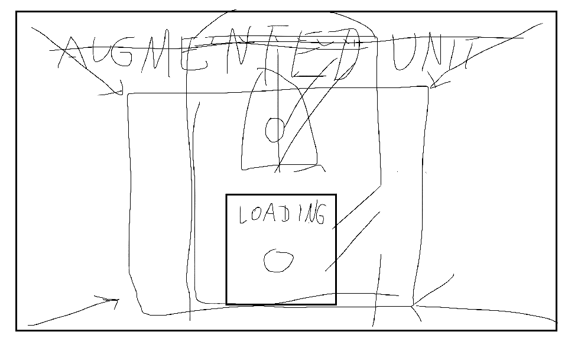

# Game Design Document

## Ogólne informacje

### Audtorzy

- Kamil Ciągło
- Mateusz Balicki

### Tytuł

Augmented Unit

### Gatunki

Gra będzie pomieszaniem gatunków gier narracyjnych i metroidvanii.
Gra narracyjna, bo silny nacisk będzie kładzony na fabułę i narrację środowiskową, z gatunku metroidvanii zapożyczona zostanie struktura poziomów i sposób postępu w grze.

### Odbiorcy

Docelową grupą odbiorców gry będą ludzie zaznajomieni z grami, w wieku około 16 do 30 lat, lub ludzie zainteresowani historiami opowiedzianymi nie wprost, z nutką niepokoju.

### Plaforma i wymagania sprzętowe

<!-- Wymagania pożyczone z gry dead cells - podobnej graficznie i poniekąd gameplay'owo do naszej gry -->

Aspekt | Minimalne: | Zalecane:
---|---|---
OS * | Windows 7+ | Windows 7+
Procesor | Intel i5+ | Intel i5+
Pamięć RAM | 2 GB RAM | 4 GB RAM
Karta graficzna | Nvidia 450 GTS / Radeon HD 5750 lub lepsza | Nvidia GTX 460 / Radeon HD 7800 lub lepsza
Miejsce na dysku | 500 MB dostępnego miejsca | 500 MB dostępnego miejsca
Dodatkowe uwagi | DirectX 9.1+ lub OpenGL 3.2+ | DirectX 9.1+ lub OpenGL 3.2+

### Monetyzacja

Gra zostanie wypuszczona w modelu free-to-play (darmowa), aby zachęcić graczy do zagrania w nią i aby zdobyć odrobinę rozgłosu na rynku. Później mogą zostać wydane płatne dodatki do gry, które rozwiną grę o opcjonalne poziomy i poszerzą historię świata.

## Tematyka i osadzenie gry

### Lokacje

Gra rozgrywać się będzie na pokładzie wojskowego statku transportowego, którego załoga została wybita, a sam statek dryfuje uszkodzony na środku oceanu.
Z uwagi na gatunek gry (metroidvania) cały statek będzie jedną, dużą mapą, ale jego konkretne sekcje będą reprezentować oddzielne poziomy.

Sekcje, które będziemy mogli znaleźć w grze:
Nazwa | Obowiązkowy | Modyfikacja | Logi | Opis
---|---|---|---|---
Pokład statku | Y | krzyk | - | przeszkody w postaci pseudo-losowych uderzeń piorunów czy powiewów wiatru
Kajuty załogi | Y | double-jump | DUŻO, przybliżające historię postaci | skrót do innych rejonów, ale jest w nim dużo trupów, które w końcowym etapie gry uniemożliwią przejście przez ten sektor
Magazyn | Y | dash | Kilka, pozwalające zapoznać się z postaciami | początkowa sekcja, w niej znajdziemy przejścia do dodatkowych poziomów i kilka podstawowych informacji, oraz drogi blokowane przez działka automatyczne
Reaktor | N | - | Kilka, pogłębienie problemów psychicznych postaci | ukryty koło ostatniej sekcji, pozwala wyłączyć zasilanie - działkom blokującym inne opcjonalne pokoje i łodzi podwodnej
Serwerownia | Y | DEM (Deus Ex Machina) | DUŻO, silniejsze podpowiedzi na pętlę czasu i możliwość wysadzenia statku | pokój z logami bezpieczeństwa, które mogą nakierować gracza na prawdziwe zakończenie gry, końcowa część gry, cutscenki tutaj
Zbrojownia | N | - | Kilka, ostatni log Jack'a i kilka o tym, po co nam broń nuklearna | w nim, z użyciem kodów z serwerowni, można aktywować bombę nuklearną, która rozpocznie odliczanie do samozniszczenia
Pokój z łodzią podwodną (submarine) | N | - | Dwa, mówiące, po co łódź i że może przetrwać wybuch nuklearny | dzięki niemu można uciec ze statku po tym, jak uruchomimy bombę, łódź potrzebuje zasilania i kodu bezpieczeństwa
Pokój treningowy | Y | Narrator | Jeden, przykład mechaniki | Pokój, do którego jesteśmy teleportowaniu w ramach samouczka, będzie początkowo pokojem developerskim, w którym później umieścimy samouczek

### Fabuła

#### Wprowadzenie

Gracz jest robotem (AU - Augmented Unit), który aktywuje się (wychodząc z kapsuły) w szczelnie zamkniętym pomieszczeniu. Dowiaduje się tutaj o swoim celu - zabezpieczeniu tajnych danych znajdujących się na statku. Po diagnozie systemów (tutorial) AU dostaje moduł odczytywania logów (narratora), a wyjście się otwiera i AU zostaje wypuszczony na statek, aby wypełnić swój cel.

#### Suche fakty

- STATEK
    - statek dryfuje zniszczony na środku oceanu
    - statek jest jednostką transportowo-badawczą
    - statek przewozi broń nuklearną, tajne wojskowe dane oraz eksperymentalną broń
    - statek jest napędzany generatorem
    - statek nie jest już sprawny
- AU
    - AU - Augmented Unit
    - AU jest robotem zdolnym do modyfikowania samego siebie, aby mógł wykonać swój cel
    - celem AU jest odzyskiwanie i chronienie danych w sytuacjach kryzysowych
    - AU jest zdolny do użycia DEM - eksperymentalnej broni, która pozwala na podróż w czasie
        - przy wybraniu tej modyfikacji AU zostaje cofnięty w czasie i przestrzeni do momentu, gdy statek jeszcze funkcjonował - zostaje uruchomiony alarm
        - AU zabija wszystkich na statku i wraca do swojej kapsuły, gdzie zostaje zresetowany i może zacząć cykl na nowo
    - AU po uruchomieniu musi przejść test systemów (tutorial) i otrzymać narratora
    - AU jest w stanie dowiedzieć się, co stało się na statku poprzez logi i rozmowy z CU
- Postaci drugoplanowe
    - Cleanup Unit (CU)
        - CU to mały robot, który pojawia się chwilę za vaultem
        - CU pomaga AU poprzez powiedzenie, że dane są w serwerowni
        - CU generalnie będzie pojawiał się, gdy gracz spędzi za dużo czasu w jednym miejscu i nie będzie wiedział, co zrobić
    - John
        - Martwy żołnierz zaraz przed wejściem do vaulta (pokoju startowego)
        - Jedyny nie walczy z AU, jest przerażony,
        - Jego log mówi o tym, że coś się zbliża, po czym słychać krzyk
    - Aaron
        - Naukowiec na wejściu do serwerowni
        - Autor logów znajdowanych na mapie opisujących strukturę statku
        - Twórca DEM
        - Odizolowany od ludzi wizjoner, pasjonat postępu, który pragnie spokoju
        - Nielubiany przez resztę załogi z uwagi na jego obsesję na punkcie DEM,
        - Statek istnieje, aby umożliwić mu pracę, wszyscy mieli go chronić
    - Admirał Connor
        - Główny dowódca wojsk
        - Opisuje w logach broń na statku, konflikt, przez który powstaje DEM i cel ich misji
        - Skupiony na pracy, stara się udawać, że nie ma życia poza statkiem
        - Zostaje zabity w walce w generatorze
        - Zabicie Szeregowego Jack' odbiło się na jego psychice i zaczął się po tym załamywać
    - Szeregowy Jack
        - Zwykły, szary żołnierz
        - Nie lubi być na tym statku i wierzy, że eksperymentalna broń w końcu ich zabije,
        - W logach opisuje to, jak bardzo chce się wyrwać z tego statku
        - Naprowadza gracza na wysadzenie statku i ucieczkę łodzią podwodną
        - Próbował sam odpalić bombę nuklearną, ale został zabity przez Admirała Connora po kilku ostrzeżeniach

#### Logi 

Nazwa | Osoba | Id* | Lokacja | Log
---|---|---|---|---
Ostatnie słowa | John | John_1 | Magazyn | Coś tu jest nie tak, coś jest nie tak! Coś pojawiło się na statku... O Boże... idzie tu! To tu idzie! Aaaaaaa!!!!
Po co to tu jest? | Aaron | Aaron_1 | Magazyn | Augmented Unit... Nie rozumiem, po co to tu trzymamy... To tak jakby ludzie oczekiwali, że ta cała operacja nie wypali, a tak nie będzie! Ale jeśli już... to lepiej, żeby ten robot odzyskał wszystkie dane, moja praca nie może przepaść!
Ci ludzie... | Aaron | Aaron_2 | Magazyn | To niewiarygodne jak dużo trzeba gadać z tymi ludźmi, zanim cokolwiek dostanę z magazynu... Czy oni nie rozumieją, że w mojej pracy CZAS JEST KLUCZOWY?!
Chociaż nie jest tak źle | Jack | Jack_1 | Magazyn | Warta w magazynie nie jest taka zła, mogę usiąść gdzieś w rogu i próbować zapomnieć o tym szaleństwie po drugiej stronie statku!
Podziw: bronie | Connor | Connor_1 | Magazyn | Za każdym razem, gdy tu przychodzę, nie mogę się powstrzymać przed podziwianiem tej kolekcji broni... Ten statek to prawdziwe dzieło sztuki!
Podziw: łódź podwodna | Connor | Connor_2 | Submarine | Ta łódź... to najcudowniejsza defensywna technologia na tym statku... ponoć może nawet przetrwać wybuch nuklearny!
Na wszelki wypadek... | Jack | Jack_2 | Submarine | Ok... Jack... pamiętaj, łódź podwodna może być aktywowana TYLKO, jeśli alarm został odpalony i generator działa, pamiętaj, żeby wszystko przygotować, zanim coś zrobisz!
Zrobiłem to... | Connor | Connor_3 | Kajuty | Zrobiłem to... Ja... Już go nie ma... I nikt nie wie... Tyl... Tylko ja mam dostęp do zbrojowni i... ja... zostawiłem go tam... Boże! [płacz]
On musi z kimś porozmawiać | Connor | Connor_4 | Magazyn | On oszalał! Wczoraj gadał jakieś głupoty, a teraz włamał się do zbrojowni! Może ktoś musi z nim porozmawiać...
Waga naszej misji | Connor | Connor_5 | Zbrojownia | Nasza misja jest ważna... to miejsce mi o tym przypomina... Jeden błąd, jeden atak i cały statek musi zostać wysadzony w powietrze! Tylko Admirał ma dostęp do tego pokoju, tylko Admirał ma kody... Tylko ja decyduję, co się stanie w przypadku ataku...
Ostatnie życzenie | Jack | Jack_3 | Zbrojownia | To słowa pożegnalne... Jeśli ktoś czyta ten log, to znaczy, że znalazł go przy moim ciele i nie zdążyłem odpalić tej bomby... Proszę... upewnij się, że DEM zostanie zniszczony... To... to jest zbyt niebezpieczne, żeby ktokolwiek mógł tego używać...
Dlaczego statek? | Aaron | Aaron_3 | Pokład | Czasami ludzie pytają się — czemu akurat statek? Czemu nie pracujesz na lądzie, czy w jakimś bunkrze? Odchodzę wtedy bez słowa... Oni nie potrafią pojąć, że woda... ona jest jak czas... płynie, pomaga zrozumieć tajniki jego działania... płynąć razem z nim, a może kiedyś... nawet pod prąd <!-- TODO: Czy to nie będzie zbyt wprost jak na to, że pokład to trzecia odwiedzana strefa? xd -->
Ten szeregowy... | Aaron | Aaron_4 | Kajuty | Ten szeregowy, jak on miał... Janek? Nie ważne! Ostatnio zaczął się sporo koło mnie kręcić, podpytuje o postęp prac, próbuje dowiedzieć się czegoś o DEM... Zabiera mi tylko czas! Chociaż... Wydaje się faktycznie zainteresowany, może się jeszcze do czegoś przydać
Nazywa to DEM | Jack | Jack_4 | Kajuty | Ostatnio wypytywałem Aarona o tę jego maszynkę... broń? Nie ważne! Nazywa to DEM, skrót od Deus Ex Machina, mówi, że to dlatego, że to tak jakby na nowo wynalazł czas i przestrzeń... Muszę dowiedzieć się więcej...
??? | ??? | ??? | ??? | ???

*Id może się zmienić, zorganizujemy to, gdy wszystkie logi będą napisane

### Postaci

#### Gracz

Augmented Unit — uniwersalny robot odpowiedzialny za przechowywanie sekretów statku w sytuacjach kryzysowych i odzyskiwanie danych. Może się modyfikować, aby ułatwić wykonanie swojego celu.

#### Przeciwnicy

- Działka automatyczne na statku blokujące dostęp do niektórych rejonów, wymagają zasilania, aby działać.
- Załoga statku (po cofnięciu się w czasie), ludzie, którzy próbują powstrzymać AU przed ucieczką ze statku(?), stoją w miejscu i strzelają.

#### NPC

Cleanup Unit (CU) - mały robot, który pomaga graczowi, jeśli ten spędzi za dużo czasu w jednym obszarze nie wykonując żadnej akcji

## Rozgrywka i mechaniki

### Cel gry (cele/wyzwania/questy)

- __Głównym celem__ gracza będzie dostanie się do wspomnianej wcześniej __Serwerowni__. Po drodze napotka różne przeszkody w postaci poruszających się platform, systemów bezpieczeństwa na statku, czy zagrożeń środowiskowych (woda/ogień/prąd).
-  __Dodatkowo__, znalezione logi będą mogły oferować informacje, na podstawie których gracz będzie mógł próbować dostać się do opcjonalnych, ukrytych obszarów, które pozwolą mu na odkrycie głębszej historii, czy ukrytych zakończeń.
- Przy __zebraniu ostatniej modyfikacji__ pojawi się pierwszy quest w grze - _"przeżyj"_ i gracz będzie musiał wrócić do początkowego pokoju w określonym czasie, przy okazji unikając zabezpieczeń, które zostaną aktywowane.

### Interakcja/kontrolery (/sterowanie?)

Postać gracza będzie kontrolowana za pomocą klawiatury (i myszy?) lub (opcjonalnie, nie w MVP) kontrolera.
Podstawowe sterowanie zostało przedstawione poniżej:

- __AD__ - poruszanie się lewo-prawo
- __Space__ - skok [dodatkowo double-jump - modyfikacja]
- __LShift__ - dash (modyfikacja)
- __E__ - interakcja
- __LPM__ - DEM (ostatnia modyfikacja, atak mieczem)
- __Q__ - krzyk (modyfikacja)

### Multiplayer

Z uwagi na gatunek gry (narracyjna), nie będzie ona wspierała gry wieloosobowej. Jedyną namiastką mogą być globalne/lokalne tablice wyników do speedrunów.

## Przebieg gry (flow)

### Mockup splashscreenów

### Cutscenki, narracja in-game'owa

- Cutscenki — nieliczne, w kluczowych momentach fabuły, renderowane w silniku, zabierając chwilowo kontrolę graczowi, lub opcjonalnie animowane (przy zakończeniach)
- Narracja — narrator odczytujący logi znajdowane na statku (lista logów w sekcji [Fabuła/Logi](#logi))

### Menu

Menu będzie animowanym przybliżeniem splashscreena z opcjami wyświetlanymi na monitorze (in-game hud)

### HUD

TODO
<!-- TODO: chcemy cokolwiek? Jakieś liczniki na cooldown modyfikacji? -->

### Mapy

Statek będzie jedną wielką mapą, na której każda [sekcja](#lokacje) będzie osobnym poziomem z "animacją" wygaszania ekranu przy przejściu między nimi (na czas ładowania poziomu).

Gracz powinien w domyśle odwiedzić pokoje w następującej kolejności:
1. Pokój treningowy (tutorial)
2. Magazyn
3. Kajuty
4. Pokład statku
5. Serwerownia

Pokoje opcjonalne nie zostały tu uwzględnione, jednak gracz od samego początku będzie miał z Magazynu dostęp do Pokoju z łodzią podwodną, z Serwerowni będzie mógł dość łatwo dostać się do Reaktora, a po jego wyłączeniu cofnąć się i przez Magazyn wrócić do Zbrojowni.

## Assety

### Styl graficzny

Gra będzie tworzona jako pixelart o (podstawowych) rozmiarach 16x16px.
Będą dominowały tutaj kolory raczej przyciemnione tak, aby postaci, logi, czy platformy wyróżniały się od otoczenia.
Całość będzie wyglądała raczej mrocznie (klimat grafiki podobny do gry `Signalis`, a ogólny wygląd/feeling do gry `Dead Cells` albo `Hollow Knight`)

### Concept-art

TODO
<!-- TODO: wkleić i opisać obrazki z OpenToonz -->

### Spritesheety

TODO
<!-- TODO: wkleic i opisać spritesheety gdy powstaną, uwzględnić miejsca w folderze -->

### Muzyka

TODO
<!-- TODO: wkleić i opisać + linki -->

### Narracja

Treść wszystkich logów (będących jedyną formą narracji w grze) znajduje się w sekcji [Fabuła/Logi](#logi)

## PoC/prototyp

Prototyp przedstawia podstawowe sterowanie w grze (surowa wersja — do dostosowania) oraz pokój.
Został skonstruowany z użyciem starych assetów i nie reprezentuje finalnej wersji gry.

Wszystkie sceny, assety i skrypty prototypu znajdują się bezpośrednio w folderze `res://PoC/everything_goes_here`.

## Implementacja

### Układ plików gry

TODO

### Byty (entity) i ich parametry

TODO

### Poziomy i ich specyficzne mechaniki

TODO

### Moyfikacje

TODO

### Common/utils/narzędzia

TODO

### TODO?

## Zakres projektu

### harmonogram i podział prac

Przy każdym zadaniu znajdzie się jedna z trzech liter, która oznacza, przez kogo zostało ono wykonane:
- B — both, oboje
- K — Kamil
- M — Mateusz

Zadania będą przypisane konkretnym tygodniom i uzupełniane na bieżąco w poniższej liście

- __Tydzień 1 (29.02.2024 - 07.03.2024)__
    - __(B)__ Przygotowanie wstępnej wersji GDD i ogólnej wizji gry
    - __(B)__ Przygotowanie concept-artów
    - __(K)__ Przygotowanie ogólnego zarysu fabuły
    - __(M)__ Research podobnych historii i inspiracji do napisania szczegółowej fabuły
    - __(K)__ Wstępne napisanie kilku logów
- __Tydzień 2 (07.03.2024 - 14.03.2024)__
    - __(K)__ Przygotowanie prototypu gry bazującego na starych assetach
    - __(M)__ Przygotowanie oprogramowania do tworzenia pixelartu
    - __(M)__ Stworzenie pierwszych projektów poziomów
    - __(K)__ Przygotowanie repozytorium i projektu gry w silniku
    - __(K)__ Kontynuowanie pracy nad fabułą i logami
    - __(B)__ Aktualizowanie GDD
    - __(M)__ Przygotowanie pierwszych wersji części assetów i animacji
- __Tydzień 3 (14.03.2024 - 21.03.2024)__
- __Tydzień 4 (21.03.2024 - 28.03.2024)__
- ...
